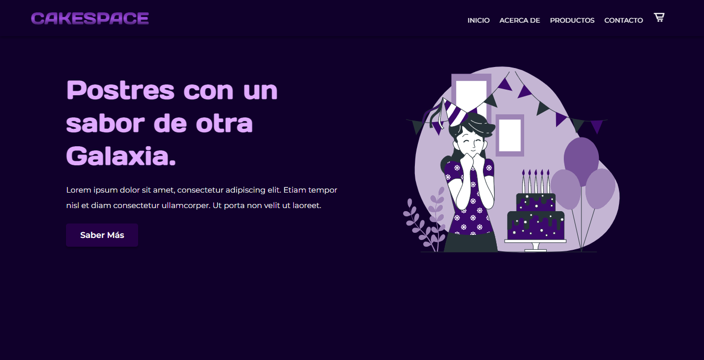
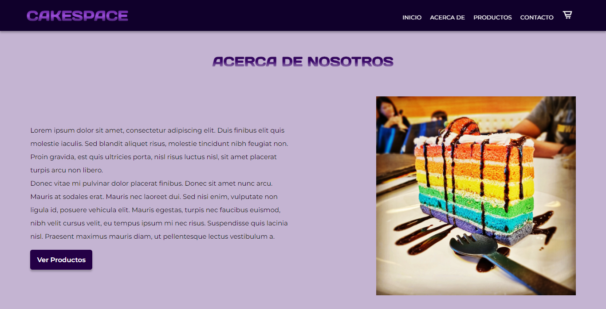
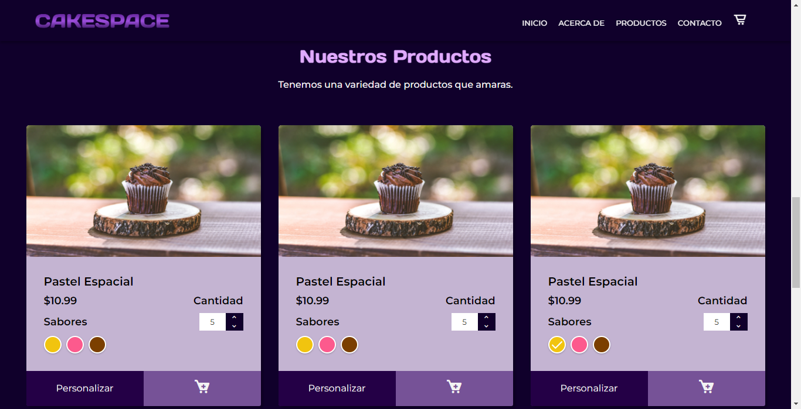
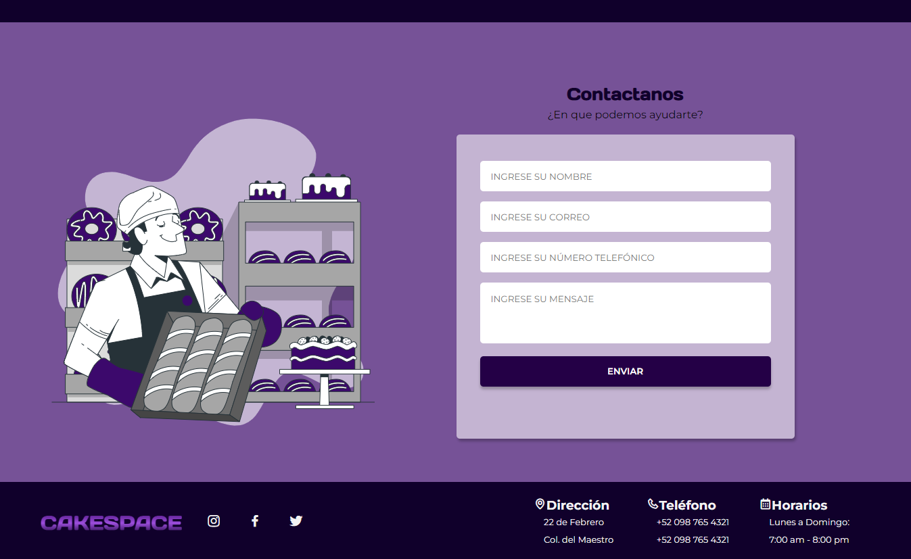
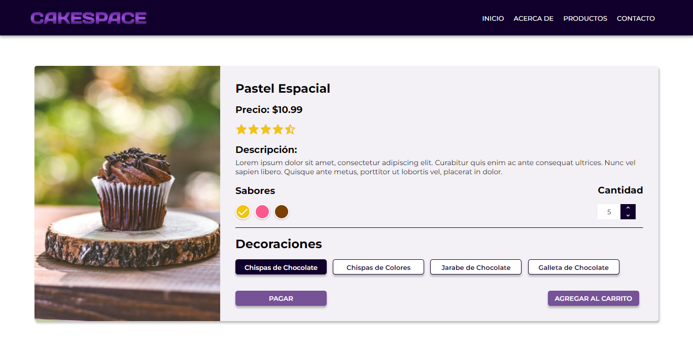
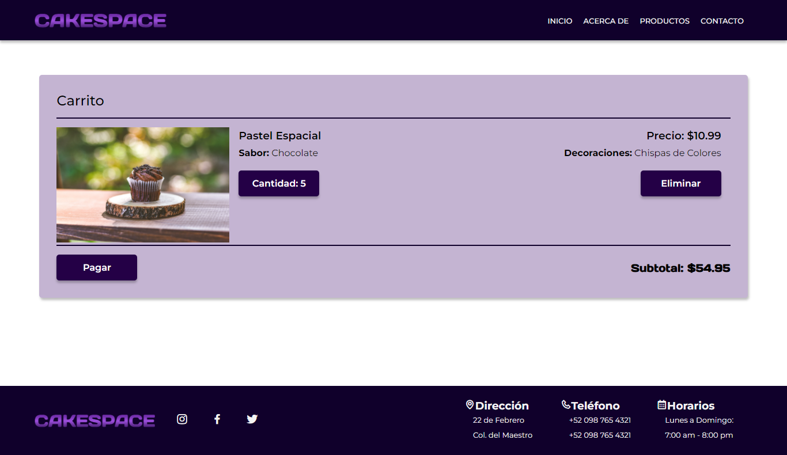

# Lanch X Kata HTML Pastelería 

## Esta es mi solución a la kata HTML de la semana 2 de LaunchX

### Solo es vista de escritorio

1. [Resultado](https://jhosiangtz.github.io/LaunchX-Semana-2-Html/)
2. [Vista del Panadero](https://jhosiangtz.github.io/LaunchX-Semana-2-Html/panadero.html)
3. [Capturas](images/screenshots/)
4. [Diseño UI](images/UI-pastel.pdf)

## Capturas de pantalla

Landing Page

Sección Sobre Nosotros

Sección De Productos

Sección De Contacto

Personalizar Producto

Carrito De Compras

Vista del panadero
